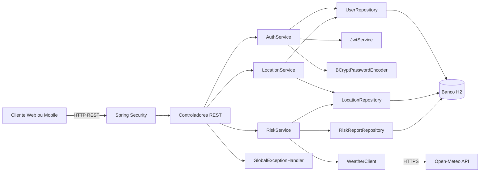
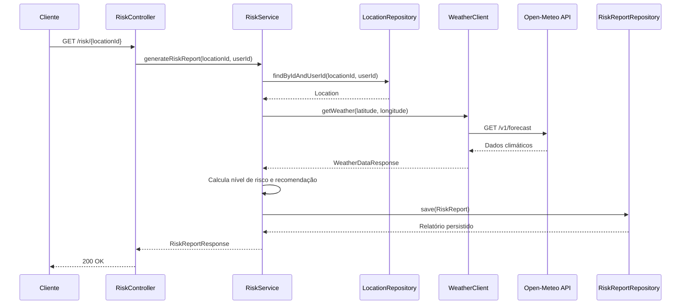
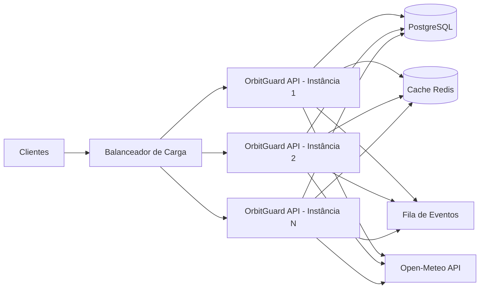
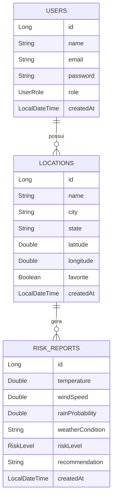

# OrbitGuard API

Backend em Spring Boot para monitoramento de locais e geração de relatórios de risco ambiental com base em dados climáticos externos.

## Visão Geral

O OrbitGuard API permite cadastrar usuários, registrar locais monitorados por coordenadas geográficas, marcar locais como favoritos e gerar relatórios de risco a partir das condições climáticas atuais.

A aplicação combina dados internos, como usuários, locais e histórico de relatórios, com dados externos obtidos da API Open-Meteo. O resultado é um relatório com temperatura, velocidade do vento, probabilidade de chuva, condição climática, nível de risco e recomendação operacional.

Principais capacidades:

- Cadastro e autenticação de usuários.
- Geração de token JWT no login e no cadastro.
- CRUD de locais monitorados por usuário.
- Marcação de locais favoritos.
- Consulta de clima por latitude e longitude usando Open-Meteo.
- Cálculo de risco ambiental em níveis `LOW`, `MEDIUM` e `HIGH`.
- Persistência do histórico de relatórios.
- Documentação interativa com Swagger/OpenAPI.
- Endpoint de saúde via Spring Boot Actuator.
- Migração de banco versionada com Flyway e massa inicial de demonstração.

## Problema Abordado

Eventos climáticos e ambientais podem impactar deslocamentos, operações, instalações e comunidades. Em muitos cenários, a tomada de decisão depende de juntar informações de localização, clima atual e um critério de risco compreensível para o usuário final.

O problema abordado pelo OrbitGuard é transformar dados climáticos brutos em uma resposta acionável:

- Onde o usuário quer monitorar?
- Quais são as condições climáticas atuais naquele ponto?
- Essas condições representam risco baixo, médio ou alto?
- Qual recomendação deve ser apresentada ao usuário?
- Como manter histórico para consulta posterior?

A API resolve isso com uma arquitetura simples de backend, separando autenticação, gestão de locais, integração externa de clima e cálculo de risco.

## Stack Técnica

| Camada | Tecnologia |
| --- | --- |
| Linguagem | Java 17 |
| Framework | Spring Boot 3.1.1 |
| API REST | Spring Web |
| Segurança | Spring Security, BCrypt, JWT |
| Persistência | Spring Data JPA |
| Migrações | Flyway |
| Banco local | H2 em memória |
| Documentação | Springdoc OpenAPI / Swagger UI |
| Observabilidade | Spring Boot Actuator |
| API climática | Open-Meteo |
| Build | Maven |

## Diagrama da Arquitetura



## Fluxo da Solução

### 1. Autenticação

1. O usuário se registra em `POST /auth/register` ou autentica em `POST /auth/login`.
2. A senha é armazenada com hash usando `BCryptPasswordEncoder`.
3. O `JwtService` gera um token JWT com:
   - `subject`: e-mail do usuário;
   - `role`: papel do usuário;
   - expiração de 1 dia.
4. A resposta retorna `token`, `name` e `email`.

### 2. Cadastro de Locais

1. O cliente envia nome, cidade, estado, latitude e longitude para `POST /locations`.
2. O controller identifica o usuário pelo cabeçalho `X-User-Id`.
3. O `LocationService` valida se o usuário existe.
4. O local é persistido com `favorite = false` por padrão.

### 3. Geração de Relatório de Risco

1. O cliente chama `GET /risk/{locationId}`.
2. O `RiskService` valida se o local pertence ao usuário.
3. O `WeatherClient` consulta a Open-Meteo usando latitude e longitude.
4. A API externa retorna temperatura, vento, código climático e probabilidade de precipitação.
5. O serviço converte o código climático em condição textual, como `Clear`, `Rain`, `Thunderstorm`.
6. O `RiskService` calcula o nível de risco.
7. O relatório é salvo em `risk_reports`.
8. A API retorna o relatório completo ao cliente.



## Comunicação Entre Serviços

A aplicação é um monólito modular. Os "serviços" internos se comunicam por chamadas diretas entre classes Spring gerenciadas por injeção de dependência.

| Origem | Destino | Tipo de Comunicação | Responsabilidade |
| --- | --- | --- | --- |
| `AuthController` | `AuthService` | Chamada interna | Cadastro e login |
| `AuthService` | `UserRepository` | Chamada interna JPA | Buscar e persistir usuários |
| `AuthService` | `JwtService` | Chamada interna | Gerar token JWT |
| `LocationController` | `LocationService` | Chamada interna | CRUD de locais |
| `LocationService` | `LocationRepository` | Chamada interna JPA | Persistência de locais |
| `RiskController` | `RiskService` | Chamada interna | Geração e consulta de relatórios |
| `RiskService` | `WeatherClient` | Chamada interna | Obter clima externo |
| `WeatherClient` | Open-Meteo | HTTP externo | Buscar dados climáticos reais |
| Serviços | Repositórios | Chamada interna JPA | Acesso ao banco H2 |

### Integração com Open-Meteo

O `WeatherClient` chama:

```text
https://api.open-meteo.com/v1/forecast
```

Parâmetros usados:

- `latitude`
- `longitude`
- `current=temperature_2m,wind_speed_10m,weather_code`
- `hourly=precipitation_probability`
- `forecast_days=1`
- `timezone=auto`

A resposta é mapeada para `WeatherDataResponse`:

```json
{
  "temperature": 28.5,
  "windSpeed": 12.0,
  "rainProbability": 60.0,
  "condition": "Rain"
}
```

## Regras de Risco

O risco é calculado em `RiskService` a partir de chuva, vento e temperatura.

| Nível | Critérios atuais |
| --- | --- |
| `HIGH` | Chuva acima de 70%, vento acima de 40 km/h, temperatura menor que 0°C ou maior que 40°C |
| `MEDIUM` | Chuva acima de 30%, vento acima de 20 km/h, temperatura menor que 5°C ou maior que 32°C |
| `LOW` | Condições abaixo dos limites de médio risco |

Recomendações retornadas:

| Risco | Recomendação |
| --- | --- |
| `HIGH` | Evite deslocamentos e siga planos de contingência. |
| `MEDIUM` | Monitorar condições e evitar áreas de risco. |
| `LOW` | Situação estável. Mantenha monitoramento. |

## Estratégia de Segurança

### Implementado Hoje

- Senhas são persistidas com hash BCrypt.
- O e-mail do usuário é único no banco.
- A aplicação gera JWT no cadastro e no login.
- O token inclui e-mail, papel do usuário, data de emissão e expiração.
- CSRF está desabilitado para simplificar o uso da API REST.
- Endpoints públicos:
  - `/auth/**`
  - `/v3/api-docs/**`
  - `/swagger-ui.html`
  - `/swagger-ui/**`
  - `/actuator/health`
- Demais endpoints exigem autenticação pelo Spring Security.
- O projeto usa HTTP Basic atualmente para simplificar testes locais.

### Limite Atual Importante

Embora a API gere JWT, ainda não há filtro de autenticação JWT conectado ao `SecurityFilterChain`. Além disso, os controllers de locais e risco usam o cabeçalho `X-User-Id` para simular o usuário autenticado.

Esse desenho é adequado para demonstração e desenvolvimento inicial, mas em produção o fluxo deve evoluir para:

- validar `Authorization: Bearer <token>`;
- extrair o usuário autenticado do token;
- remover dependência do cabeçalho `X-User-Id`;
- externalizar a chave secreta do JWT;
- configurar rotação de chaves;
- adicionar controle de papéis por endpoint;
- habilitar CORS apenas para origens confiáveis;
- usar HTTPS obrigatório.

## Visão de Escalabilidade e Resiliência

### Estado Atual

A aplicação roda como um backend Spring Boot único, com banco H2 em memória. Esse formato é simples para desenvolvimento, apresentação acadêmica e validação funcional rápida.

Pontos atuais:

- Baixa complexidade operacional.
- Deploy simples como aplicação Java.
- Estado persistido no H2 apenas enquanto a aplicação está em execução.
- Comunicação externa direta com Open-Meteo a cada geração de relatório.

### Evolução Recomendada para Escala

Para um cenário com múltiplos usuários e uso real, a arquitetura pode evoluir da seguinte forma:



Recomendações:

- Substituir H2 por PostgreSQL ou outro banco relacional gerenciado.
- Tornar a aplicação sem estado, mantendo sessão e autenticação via JWT validado a cada requisição.
- Usar cache para previsões climáticas por coordenada e janela de tempo.
- Adicionar tempo limite e nova tentativa controlada nas chamadas externas.
- Adicionar circuit breaker para falhas da Open-Meteo.
- Criar resposta alternativa para relatório parcial quando a API externa estiver indisponível.
- Enviar geração de relatórios recorrentes para fila assíncrona.
- Rodar múltiplas instâncias atrás de um balanceador de carga.
- Centralizar registros, métricas e rastreamentos.
- Usar verificações de saúde para prontidão e vivacidade.

### Resiliência na Integração Climática

A chamada à Open-Meteo é um ponto externo de falha. Para endurecer o sistema, a evolução natural é:

- configurar tempo limite no `RestTemplate`;
- tratar erros de rede com resposta de negócio clara;
- cachear a última previsão válida do local;
- registrar falhas de integração com contexto;
- aplicar circuit breaker para evitar sobrecarga em falhas repetidas;
- separar relatório "calculado com dados atuais" de relatório "calculado com último dado conhecido".

## Modelo de Dados



## Endpoints

### Autenticação

| Método | Rota | Autenticação | Descrição |
| --- | --- | --- | --- |
| `POST` | `/auth/register` | Pública | Cadastra usuário e retorna JWT |
| `POST` | `/auth/login` | Pública | Autentica usuário e retorna JWT |

Exemplo de cadastro:

```json
{
  "name": "Maria Silva",
  "email": "maria@email.com",
  "password": "123456"
}
```

Resposta:

```json
{
  "token": "jwt-gerado",
  "name": "Maria Silva",
  "email": "maria@email.com"
}
```

### Locais

| Método | Rota | Descrição |
| --- | --- | --- |
| `POST` | `/locations` | Cria local monitorado |
| `GET` | `/locations` | Lista locais do usuário |
| `GET` | `/locations/{id}` | Busca local por id |
| `PUT` | `/locations/{id}` | Atualiza local |
| `DELETE` | `/locations/{id}` | Remove local |
| `PATCH` | `/locations/{id}/favorite` | Alterna favorito |
| `GET` | `/locations/favorites` | Lista favoritos |

Exemplo de local:

```json
{
  "name": "Unidade Paulista",
  "city": "São Paulo",
  "state": "SP",
  "latitude": -23.5614,
  "longitude": -46.6559
}
```

Para os endpoints de locais, o projeto atual usa:

```text
X-User-Id: 1
```

Se o cabeçalho não for enviado, o código assume `1` como usuário padrão de demonstração.

### Risco

| Método | Rota | Descrição |
| --- | --- | --- |
| `GET` | `/risk/{locationId}` | Gera relatório de risco para um local |
| `GET` | `/risk/history` | Lista histórico de risco do usuário |
| `GET` | `/risk/history/location/{locationId}` | Lista histórico de risco de um local |

Exemplo de resposta:

```json
{
  "id": 1,
  "locationName": "Unidade Paulista",
  "temperature": 28.5,
  "windSpeed": 12.0,
  "rainProbability": 60.0,
  "weatherCondition": "Rain",
  "riskLevel": "MEDIUM",
  "recommendation": "Monitorar condições e evitar áreas de risco.",
  "createdAt": "2026-06-09T15:30:00"
}
```

## Tratamento de Erros

Erros são tratados por `GlobalExceptionHandler` e retornam um corpo padronizado:

```json
{
  "message": "Local não encontrado",
  "error": "NOT_FOUND",
  "status": 404,
  "timestamp": "2026-06-09T15:30:00"
}
```

Tipos atuais:

| Exceção | Código | Erro |
| --- | --- | --- |
| `NotFoundException` | `404` | `NOT_FOUND` |
| `BusinessException` | `400` | `BUSINESS_ERROR` |
| `Exception` | `500` | `INTERNAL_ERROR` |

## Como Executar Localmente

Pré-requisitos:

- Java 17
- Maven
- Acesso à internet para consulta à Open-Meteo

Com Maven instalado:

```bash
mvn spring-boot:run
```

Gerar pacote:

```bash
mvn clean package
```

Rodar o JAR:

```bash
java -jar target/orbitguard-api-0.0.1-SNAPSHOT.jar
```

Validação rápida de compilação:

```bash
mvn -q -DskipTests compile
```

## URLs Úteis

| Recurso | URL |
| --- | --- |
| Swagger UI | `http://localhost:8080/swagger-ui.html` |
| OpenAPI JSON | `http://localhost:8080/v3/api-docs` |
| Health check | `http://localhost:8080/actuator/health` |
| H2 Console | `http://localhost:8080/h2-console` |

Configuração do H2:

```properties
spring.datasource.url=jdbc:h2:mem:orbitguard
spring.datasource.username=sa
spring.datasource.password=
```

## Migrações e Dados Mockados

O projeto usa Flyway para versionar o schema do banco e carregar dados iniciais. As migrações ficam em:

```text
src/main/resources/db/migration
└── V1__create_schema_and_seed_data.sql
```

A migração inicial cria:

- tabela `users`;
- tabela `locations`;
- tabela `risk_reports`;
- chaves estrangeiras entre usuário, local e relatório;
- índices para consultas por usuário, favorito e local;
- usuários, locais e relatórios mockados.

Usuários disponíveis para o fluxo de autenticação:

| Perfil | E-mail | Senha | Papel |
| --- | --- | --- | --- |
| Usuário demonstração | `user@orbitguard.com` | `123456` | `USER` |
| Administrador | `admin@orbitguard.com` | `admin123` | `ADMIN` |

Locais mockados:

| Id | Nome | Cidade | Favorito | Usuário |
| --- | --- | --- | --- | --- |
| `1` | FIAP Paulista | São Paulo/SP | Sim | `user@orbitguard.com` |
| `2` | Porto de Santos | Santos/SP | Não | `user@orbitguard.com` |
| `3` | Centro do Rio | Rio de Janeiro/RJ | Sim | `user@orbitguard.com` |
| `4` | Operação Curitiba | Curitiba/PR | Não | `admin@orbitguard.com` |

Como o banco é H2 em memória, os dados são recriados a cada inicialização da aplicação. Para evoluir o schema, crie novas migrações com o padrão:

```text
V2__descricao_da_mudanca.sql
V3__outra_mudanca.sql
```

## Estrutura do Projeto

```text
src/main/java/com/orbitguard/api
├── client
│   └── WeatherClient.java
├── config
│   ├── RestTemplateConfig.java
│   └── SecurityConfig.java
├── controller
│   ├── AuthController.java
│   ├── LocationController.java
│   └── RiskController.java
├── dto
├── enums
├── exception
├── model
├── repository
├── security
│   └── JwtService.java
└── service
    ├── AuthService.java
    ├── LocationService.java
    └── RiskService.java
src/main/resources
└── db
    └── migration
        └── V1__create_schema_and_seed_data.sql
```

## Próximos Passos Técnicos

- Implementar filtro JWT real no Spring Security.
- Remover o uso de `X-User-Id` como identificação do usuário.
- Externalizar segredo JWT e configurações sensíveis.
- Trocar H2 por PostgreSQL em ambiente persistente.
- Adicionar testes unitários e de integração.
- Configurar tempos limite no `RestTemplate`.
- Adicionar resiliência para falhas da Open-Meteo.
- Criar validações explícitas nos DTOs com anotações como `@NotBlank`, `@Email` e `@NotNull`.
- Adicionar versionamento de API, como `/api/v1`.
